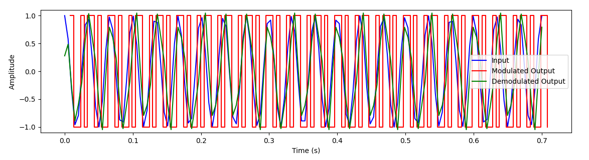

# Sigma-Delta-Modulator

## Overview

This Python script simulates Sigma-Delta modulation, an oversampling method utilized in analog-to-digital converters (ADCs), to encode signals into low bit-depth digital signals at high sample frequencies. Implemented with SciPy, the simulation focuses on the modulation process, allowing analysis into the modulated and demodulated signals.

## Features

- Applied signal processing techniques for high resolution analog-to-digital conversion
- Utilized Butterworth filtering for demodulation, verified through visualization

# Simulation

- Overlapped:

